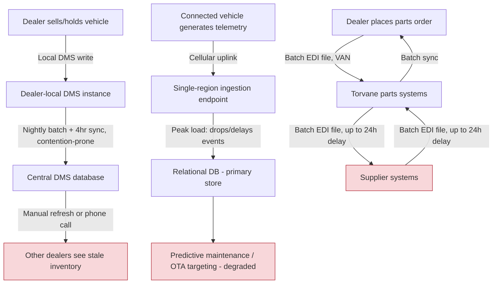

# As-Is Business Architecture

## Overview

This document describes the current-state business architecture for the three processes at the center of the modernization program: vehicle inventory management, connected-vehicle telemetry handling, and parts supply chain fulfillment. It is the baseline the to-be architecture (see [to-be-business-architecture.md](./to-be-business-architecture.md)) is measured against, and the source of the gaps prioritized in [gap-analysis.md](../05-phase-e-opportunities-and-solutions/gap-analysis.md).

## Vehicle Inventory Management (As-Is)

Each dealer runs a local instance of dealer-facing DMS functionality against a centralized on-premises database cluster located in Torvane's primary data center. Inventory status changes (a vehicle sold, transferred, or placed on hold) are written locally and replicated to the central database via a nightly batch synchronization job, with an additional near-real-time sync attempted every 4 hours but frequently delayed by contention on the central database during business hours. A dealer checking inventory at a sister dealership is therefore looking at data that can be between minutes and several hours stale, and in observed worst cases (data center maintenance windows) up to 24 hours stale.

There is no event-based notification when inventory state changes — dealers must manually refresh or call another dealership directly to confirm real-time availability, which is common practice today and is itself evidence of the system's inadequacy for its stated purpose.

## Connected-Vehicle Telemetry (As-Is)

EV and connected vehicles transmit telemetry (battery state, diagnostic codes, location for opt-in features) over cellular connectivity to a telemetry ingestion service that was built as a three-month proof of concept and never re-architected as fleet volume grew. It uses a single-region ingestion endpoint with a relational database as its primary write target, which was adequate for a pilot fleet of a few thousand vehicles but now regularly drops or delays events during peak ingestion windows (typically weekday evenings as commuters return home and vehicles sync accumulated data).

Predictive maintenance alerts and over-the-air (OTA) update targeting both depend on this pipeline; degraded ingestion directly degrades both features, which are marketed capabilities of the EV product line.

## Parts Supply Chain (As-Is)

Parts orders, inventory levels, and fulfillment status move between Torvane, its parts distribution centers, and its supplier network via batch EDI file exchange over a value-added network (VAN), following EDI standards for purchase orders, inventory advice, and shipment notices. Files are generated and transmitted on fixed batch windows (typically 2–4 times daily depending on trading partner), meaning a parts order placed by a dealer may not be visible to a supplier for up to 24 hours, and a supplier's inventory update may not reach Torvane's systems for a further 24 hours — the compounding effect is the 24–48 hour latency cited in the business case.

## As-Is Process Flow

## Business Impact Summary

The common thread across all three processes is **batch-oriented, point-to-point integration with no shared event backbone**, which was an acceptable design when Torvane's dealer network and EV fleet were an order of magnitude smaller. The as-is architecture does not fail catastrophically — it fails by degrees, in ways that are individually tolerable but collectively now material to competitive position, dealer satisfaction, and revenue. This is precisely why the problem was not addressed sooner and why it now requires an explicit, funded modernization program rather than incremental patching.

*Fictional case study — see [README](../README.md) for full disclaimer.*
