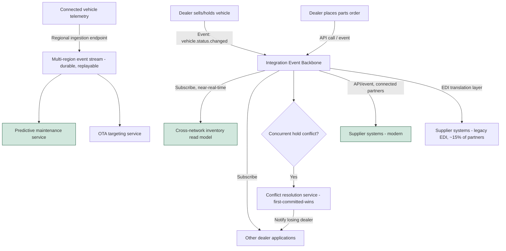

# To-Be Business Architecture

## Overview

This document describes the target-state business architecture for vehicle inventory, connected-vehicle telemetry, and parts supply chain — the same three processes covered in [as-is-business-architecture.md](./as-is-business-architecture.md) — after the modernization program completes. The to-be design is anchored to the architecture principles (see [architecture-principles.md](../00-preliminary/architecture-principles.md)), particularly the shared-event-backbone and eventual-consistency principles, both of which represent a deliberate departure from the as-is batch/point-to-point model.

## Vehicle Inventory Management (To-Be)

Inventory state changes are published as domain events (`vehicle.status.changed`, `vehicle.hold.placed`, `vehicle.hold.released`) to the integration backbone at the moment they occur in the originating dealer system, rather than batched. Every dealer-facing application and the central inventory read model subscribe to these events and update within seconds. A dealer checking cross-network availability sees a near-real-time view, with an explicit "last updated" timestamp and a defined staleness tolerance (target: under 30 seconds at the 95th percentile) rather than an implicit and unbounded staleness the as-is state never disclosed to users.

Because the design assumes eventual consistency (Principle 4) rather than distributed transactions, a rare double-hold race condition (two dealers place a hold within the same sub-second window) is handled by an explicit conflict-resolution service that applies a first-committed-wins rule and immediately notifies the losing dealer — a visible, understood exception state, rather than the silent data staleness dealers experience today.

## Connected-Vehicle Telemetry (To-Be)

Telemetry ingestion moves to a horizontally scalable, multi-region event-streaming pipeline purpose-built for high-volume time-series ingestion (architecture detail in [ADR-005](../adrs/adr-005-ev-telemetry-ingestion-architecture.md)). Vehicles publish telemetry to regional ingestion endpoints load-balanced across the fleet's geographic distribution; the pipeline is designed and load-tested to sustain 100,000+ concurrently reporting vehicles, a target set at roughly 5x the EV fleet size projected at the end of the 3-year program to avoid repeating the as-is pattern of building only to current-year scale. Predictive maintenance and OTA targeting consume from durable, replayable event streams rather than a single relational store, meaning a downstream consumer outage no longer causes permanent data loss — events are retained and reprocessed on recovery.

## Parts Supply Chain (To-Be)

Trading partners capable of consuming modern interfaces move from batch EDI files to a real-time API and event model: purchase orders, inventory advice, and shipment status are exchanged as they occur, targeting under 15 minutes order-to-visibility latency for connected partners. Per the explicit scope decision in [vision-and-scope.md](../01-phase-a-vision-and-scope/vision-and-scope.md), the smallest ~15% of suppliers who cannot yet consume modern APIs remain on EDI through an EDI-to-event translation layer at the integration backbone boundary, so the rest of the platform does not need to know which mode a given partner uses.

## To-Be Process Flow

## Business Capability Changes

The to-be architecture does not just make the as-is processes faster — it changes what the business can do. Real-time inventory visibility enables cross-dealer vehicle transfer recommendations at the point of sale (a capability that does not exist today because the data isn't trustworthy enough to act on in real time). Scalable telemetry ingestion enables predictive maintenance to become a differentiated product feature rather than a best-effort one. Real-time parts visibility enables dealer service bays to quote accurate parts ETAs to customers at time of service booking, directly addressing a top-cited customer complaint in service satisfaction surveys.

*Fictional case study — see [README](../README.md) for full disclaimer.*
