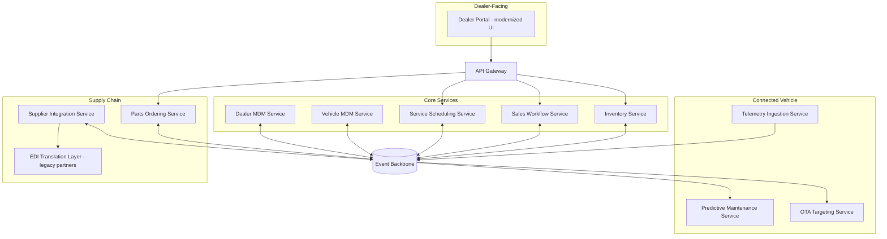

# Application Architecture

## Purpose

This document describes the as-is application landscape and the to-be target application architecture for the systems in scope of the modernization program, complementing the data architecture in [data-architecture.md](./data-architecture.md).

## As-Is Application Landscape

The current landscape is dominated by three large, tightly coupled applications, each with its own database and minimal formal integration:

- **Core DMS** — a monolithic application covering inventory, sales workflow, service scheduling, and basic dealer CRM functions, deployed on-premises. Its modules share a single database schema, meaning even a low-risk change to service scheduling requires regression testing across inventory and sales modules, which is the direct cause of the 6–8 week release cycle cited in the business case.
- **Telemetry Ingestion Platform** — a single-region application built as a proof of concept, now running past its designed capacity, with tightly coupled ingestion and processing logic that makes independent scaling of either impossible.
- **EDI Gateway** — a batch file-processing application handling parts, purchase order, and shipment data exchange with suppliers over a value-added network, with per-trading-partner custom mapping logic that has accumulated organically over more than a decade with limited documentation.

These three applications integrate with each other and with adjacent systems (finance, manufacturing extracts, dealer CRM) almost entirely through nightly batch file transfers or, in a few cases, direct database views — both patterns the target architecture explicitly moves away from per Principle 2 and Principle 6.

## To-Be Application Architecture

The target landscape decomposes the DMS monolith into independently deployable services aligned to business capability boundaries (Principle 6), fronted by an API gateway, and integrated through the event backbone described in [reference-architecture.md](../04-phase-d-technology-architecture/reference-architecture.md):

- **Inventory Service** — owns vehicle inventory state and publishes state-change events; the highest-priority service given the business case's inventory visibility target.
- **Sales Workflow Service** — handles the sales transaction process, consuming inventory state and publishing sale-completion events.
- **Service Scheduling Service** — independently deployable from Sales/Inventory, reflecting that service bay operations have materially different load patterns and release cadence needs.
- **Telemetry Ingestion Service** — the re-architected multi-region ingestion pipeline (detail in [ADR-005](../adrs/adr-005-ev-telemetry-ingestion-architecture.md)).
- **Predictive Maintenance Service** and **OTA Targeting Service** — decoupled consumers of the telemetry event stream, independently scalable and deployable from ingestion itself.
- **Parts Ordering Service** and **Supplier Integration Service** — replacing EDI Gateway's real-time-capable functions, with the EDI translation layer retained as a bounded legacy-compatibility component per the scope decision in [vision-and-scope.md](../01-phase-a-vision-and-scope/vision-and-scope.md).
- **Vehicle/Dealer MDM Services** — the canonical master data services described in the data architecture.

Rather than a full "buy vs. build" split decided once, each service was evaluated individually in Phase E (see [solution-building-blocks.md](../05-phase-e-opportunities-and-solutions/solution-building-blocks.md)); several — notably Inventory Service and the core sales workflow — are built on a commercial DMS platform core (see [vendor-evaluation.md](../05-phase-e-opportunities-and-solutions/vendor-evaluation.md)) rather than fully custom-built, consistent with Principle 3.

## Application Landscape Diagram

## Rationalization Approach

The application architecture does not decompose every legacy module on day one. Service Scheduling, for example, is decomposed in Wave 3 of the migration roadmap rather than Wave 1, because its coupling to Inventory is looser than Sales Workflow's and the business case impact of decomposing it early is lower — a deliberate sequencing trade-off documented in [transition-architectures.md](../06-phase-f-migration-planning/transition-architectures.md) rather than an oversight.

*Fictional case study — see [README](../README.md) for full disclaimer.*
