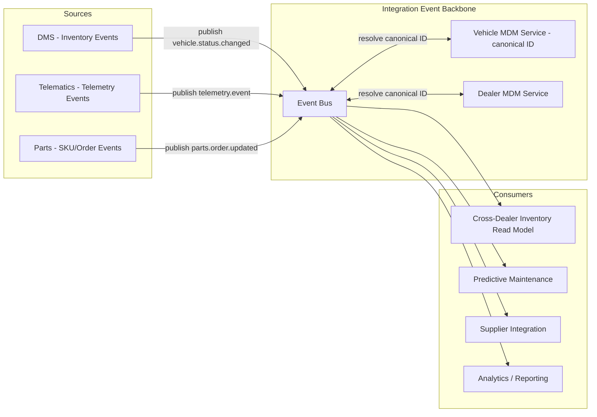

# Data Architecture

## Purpose

This document defines Torvane's target data architecture for the domains touched by the modernization program, resolving the master data fragmentation identified in the as-is business architecture (see [as-is-business-architecture.md](../02-phase-b-business-architecture/as-is-business-architecture.md)) and enforcing Principle 2 (Data Is a Shared Enterprise Asset) and Principle 11 (Minimize Data Duplication) from [architecture-principles.md](../00-preliminary/architecture-principles.md).

## As-Is Data Landscape

Torvane's current data landscape has no formal master data management function. The clearest symptom: a single physical vehicle is represented by at least four independent identifiers across systems — a VIN-derived key in the DMS, a separate manufacturing-sequence identifier inherited from the plant MES extract, a telematics device ID in the connected-vehicle platform (which is not guaranteed to map 1:1 to a vehicle over its lifetime, e.g., after a telematics module replacement), and a dealer-assigned stock number used at the point of sale. Reconciling "is this the same vehicle" across systems today is a manual, error-prone process handled by a small data operations team using nightly matching scripts with a known ~3% unresolved-match rate.

Dealer and customer data show a similar, if less severe, pattern: dealer records are duplicated between the DMS and a separate dealer relationship management extract used by the finance and marketing functions, with periodic manual reconciliation.

## Target Data Domains

| Domain | Owning Function | Canonical Identifier | Primary Consumers |
|---|---|---|---|
| Vehicle | Manufacturing/Product Data (new cross-functional ownership, established by this program) | Canonical Vehicle ID, VIN-anchored, cross-referenced to all legacy identifiers during migration | DMS, Telematics, Parts, Dealer Portal |
| Dealer | Dealer Operations | Canonical Dealer ID | DMS, Finance, Marketing, Parts |
| Customer | Customer Data Governance (existing function, scope extended) | Canonical Customer ID (privacy-scoped; see note below) | DMS, Connected Vehicle App, Marketing (read-only) |
| Inventory State | DMS domain (event-sourced) | Vehicle ID + location context | Cross-dealer inventory read model, Dealer Portal |
| Parts/SKU | Supply Chain & Parts Operations | Canonical Parts SKU | Parts Ordering, Supplier Integration, Service Scheduling |
| Telemetry Event | Connected Vehicle & Telematics | Vehicle ID + event stream offset | Predictive Maintenance, OTA Targeting, Analytics |

**Note on Customer domain:** Customer identity resolution is deliberately scoped narrower than Vehicle/Dealer — the Customer Data Governance function retains primary ownership, and this program only extends its schema to support the vehicle-ownership relationship needed for connected-vehicle features, rather than taking over customer MDM broadly. This boundary was set explicitly at the Phase C ARB review to avoid this program's scope creeping into an adjacent, separately governed data domain.

## Integration Pattern: Event-Carried State Transfer

Cross-domain data flow uses **event-carried state transfer** over the integration backbone (architecture detail in [reference-architecture.md](../04-phase-d-technology-architecture/reference-architecture.md)): a domain publishes an event containing enough state for consumers to update their own read models without a synchronous callback to the source system. This was chosen over two alternatives:

- **Shared database access** — rejected because it is the direct cause of the as-is fragmentation problem; any system with direct query access to another domain's database inevitably develops undocumented dependencies on that schema's internal structure.
- **Synchronous request/response (API-only) integration** — rejected as the *sole* pattern because it creates temporal coupling: if the Vehicle domain service is down, every consumer needing vehicle data would fail synchronously, which conflicts with Principle 12 (Resilience). APIs are still used for on-demand queries but are not the primary mechanism for cross-domain state propagation.

## Data Migration Approach

Legacy identifier cross-referencing is maintained in a migration mapping table for the duration of Phase F, allowing old and new systems to resolve the same physical vehicle during the parallel-run period defined per wave in [migration-roadmap.md](../06-phase-f-migration-planning/migration-roadmap.md). This mapping table is explicitly temporary — its retirement is a tracked exit criterion for the final migration wave, not a permanent architecture fixture.

## Target Data Flow

## Data Quality and Governance

Every canonical domain has a named data steward accountable for schema evolution and quality metrics, reporting into the Head of Data Governance (see [stakeholder-map.md](../01-phase-a-vision-and-scope/stakeholder-map.md)). Schema changes to any published event follow a backward-compatibility policy: additive changes only within a major version; breaking changes require a new versioned event type with a minimum 6-month dual-publish deprecation window, to avoid forcing synchronized deployment across domains that the loosely-coupled architecture is specifically designed to avoid.

*Fictional case study — see [README](../README.md) for full disclaimer.*
