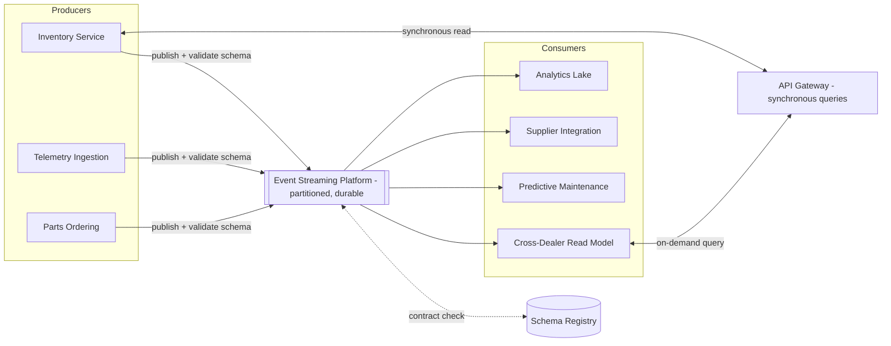

# Reference Architecture: Event-Driven Integration Backbone

## Purpose

This document defines the reference architecture for Torvane's integration backbone — the pattern underpinning the data architecture ([data-architecture.md](../03-phase-c-information-systems-architecture/data-architecture.md)) and application architecture ([application-architecture.md](../03-phase-c-information-systems-architecture/application-architecture.md)) target states. It is written as a reusable reference, not a one-off design, because the same pattern is expected to be applied to future domains beyond this program's initial scope (parts, telemetry, inventory).

## Pattern Description

The event-driven integration backbone consists of:

1. A **durable, partitioned event streaming platform** as the backbone's transport layer, retaining events for a configurable window (minimum 7 days for operational streams, longer for audit-relevant streams) to support consumer replay after outages.
2. **Domain-owned producers** that publish state-change events for entities they own, using a schema registry to enforce contract compatibility.
3. **Independent consumers** that subscribe to the streams relevant to them and build their own local read models, rather than querying producer databases directly.
4. An **API gateway** for synchronous, on-demand queries (e.g., "give me current inventory for dealer X right now") layered alongside the event backbone, not as a replacement for it — the two patterns serve different interaction needs.
5. A **schema registry and contract versioning policy** enforcing the backward-compatibility rules described in the data architecture.

## Reference Diagram

## Applicability Conditions

This pattern is appropriate when:

- Multiple independent consumers need the same state changes and can tolerate eventual consistency (seconds, not milliseconds).
- Producers and consumers are owned by different teams or evolve on independent release cycles.
- The business process can represent and recover from a "pending reconciliation" state (Principle 4).
- Audit/replay of historical state changes has standalone business value (e.g., diagnosing why an inventory conflict occurred).

## When NOT to Use This Pattern

This is the section the ARB required be made explicit, after the Phase D review flagged a risk of "event-driven" becoming a default reflex applied even where it adds unjustified complexity. The event-driven backbone is the **wrong** choice under any of the following conditions, and a different pattern should be selected instead:

- **Strict, immediate consistency is a hard business requirement.** Financial settlement between Torvane and a dealer (e.g., a wholesale vehicle purchase transaction) requires synchronous, transactionally consistent confirmation — using eventual-consistency event flow here would introduce reconciliation risk in a process where the business is explicitly unwilling to accept it. These flows should use synchronous APIs with proper distributed-transaction boundaries kept narrow and explicit, not the event backbone.
- **Low-volume, tightly scoped, single-consumer integration.** If exactly one system needs data from exactly one other system, and that need is unlikely to expand to additional consumers, a direct point-to-point API call is simpler, cheaper to operate, and easier to debug than standing up a producer, schema contract, and topic on the shared backbone. Forcing every integration through the backbone "for consistency" adds operational overhead disproportionate to the benefit — this was explicitly rejected as a blanket policy during Phase D.
- **The consuming team cannot operate asynchronous failure handling.** Event-driven consumers must handle out-of-order delivery, at-least-once delivery duplicates, and replay scenarios. A small dealer-facing team without the operational maturity to build idempotent consumers is a poor fit for direct backbone integration; for these cases, the API gateway's synchronous interface is a deliberately simpler on-ramp, even though it does not get automatic event notification.
- **Regulatory or contractual requirements mandate a specific, auditable point-to-point channel** (for example, certain government reporting integrations mandate a specific file format and transmission method that cannot be replaced by an internal event stream) — in these cases, a dedicated compliance-integration component sits at the backbone's edge and is not itself event-driven internally.
- **The data has a natural batch cadence and no legitimate real-time consumer.** Not everything benefits from event-driven treatment — Torvane's annual dealer franchise agreement renewal data, for instance, changes rarely and has no consumer needing sub-day freshness; modeling it as a continuous event stream would be architecture for its own sake.

## Trade-offs Accepted

Adopting this pattern as the default integration approach increases operational complexity relative to simpler point-to-point integration: it requires a schema registry, event streaming platform operations expertise (a net-new capability per the capability map), and consumer-side idempotency discipline across every team that integrates with the backbone. The ARB accepted this cost because the as-is architecture's alternative — accumulating point-to-point integrations — is the demonstrated root cause of the current inventory and parts visibility failures; the backbone is judged to trade a higher upfront and ongoing operational cost for materially lower long-term integration complexity and better resilience characteristics (Principle 12).

*Fictional case study — see [README](../README.md) for full disclaimer.*
