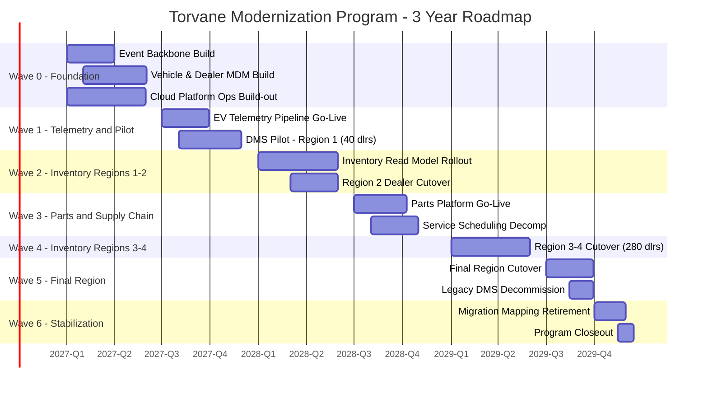

# Migration Roadmap

## Approach

The migration is sequenced into six waves over three years (12 quarters), combining a capability-based sequencing logic (per [gap-analysis.md](../05-phase-e-opportunities-and-solutions/gap-analysis.md)) with a dealer-region rollout model that satisfies Principle 1 (Dealer Operations Continuity). No wave migrates more than roughly 120 dealers at once, and every wave includes a mandatory parallel-run period before the prior wave's systems are decommissioned. Cutover windows are scheduled outside each region's peak sales season, a constraint surfaced directly by the Dealer Network Advisory Council during Phase A stakeholder consultation (see [stakeholder-map.md](../01-phase-a-vision-and-scope/stakeholder-map.md)) and treated as binding rather than advisory.

## Wave Summary

| Wave | Quarter(s) | Scope | Key Deliverable |
|---|---|---|---|
| Wave 0 — Foundation | Q1–Q2, Year 1 | Event backbone stood up; Vehicle & Dealer MDM services built; cloud platform operations capability established | No dealer-facing change yet; foundational build only |
| Wave 1 — Telemetry & Pilot Region | Q3–Q4, Year 1 | EV Telemetry Ingestion Pipeline goes live (all regions, since telemetry is not dealer-region-scoped); DMS Core Platform (Vendor A) piloted with 40 dealers in one region | First customer-facing improvement: predictive maintenance/OTA reliability |
| Wave 2 — Inventory Visibility, Regions 1–2 | Q1–Q2, Year 2 | Cross-Dealer Inventory Read Model live for pilot + 2 additional regions (~180 dealers cumulative) | Cross-dealer inventory visibility target met for ~30% of network |
| Wave 3 — Parts & Supply Chain, All Regions | Q3–Q4, Year 2 | Parts Ordering & Supplier Integration Platform live network-wide; Service Scheduling Service decomposed from DMS monolith | Parts latency target met for connected trading partners network-wide |
| Wave 4 — Inventory Visibility, Regions 3–4 | Q1–Q2, Year 3 | Remaining ~280 dealers cut over to new DMS core and inventory read model | ~80% of network on target architecture |
| Wave 5 — Final Region & Legacy Decommission | Q3, Year 3 | Final ~120 dealers cut over; legacy DMS monolith and legacy telemetry pipeline decommissioned | 100% network on target architecture |
| Wave 6 — Stabilization & Migration Mapping Retirement | Q4, Year 3 | Legacy identifier mapping table retired (per [data-architecture.md](../03-phase-c-information-systems-architecture/data-architecture.md)); EDI translation layer reviewed for sunset planning | Program formally closed; steady-state operations handed to Cloud Platform Engineering |

## Gantt View

## Risk-Weighted Sequencing Decisions

Two sequencing decisions were contested at the Phase F ARB gate and are recorded here for traceability:

- **Telemetry before inventory.** Inventory visibility has the larger quantified business impact ($1.8M/year), which argued for sequencing it first. It was placed second because the telemetry pipeline was independently assessed as closer to a hard capacity failure (load testing showed degradation beginning at roughly 1.3x current peak volume, with EV fleet growth on pace to cross that threshold within approximately 9 months) — an operational risk with a shorter fuse than the inventory business-impact case, even though the latter is larger in total dollar terms.
- **Pilot region size of 40 dealers.** The Program Director proposed piloting with 15 dealers to reduce initial risk exposure; the ARB increased this to 40 after Finance noted that a 15-dealer pilot would not generate statistically meaningful adoption and inventory-latency metrics against the success criteria in [vision-and-scope.md](../01-phase-a-vision-and-scope/vision-and-scope.md), risking a Wave 2 go/no-go decision made on insufficient data.

*Fictional case study — see [README](../README.md) for full disclaimer.*
